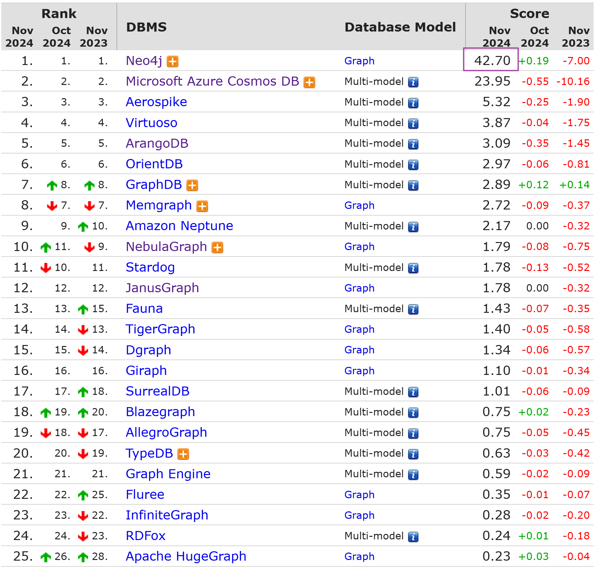
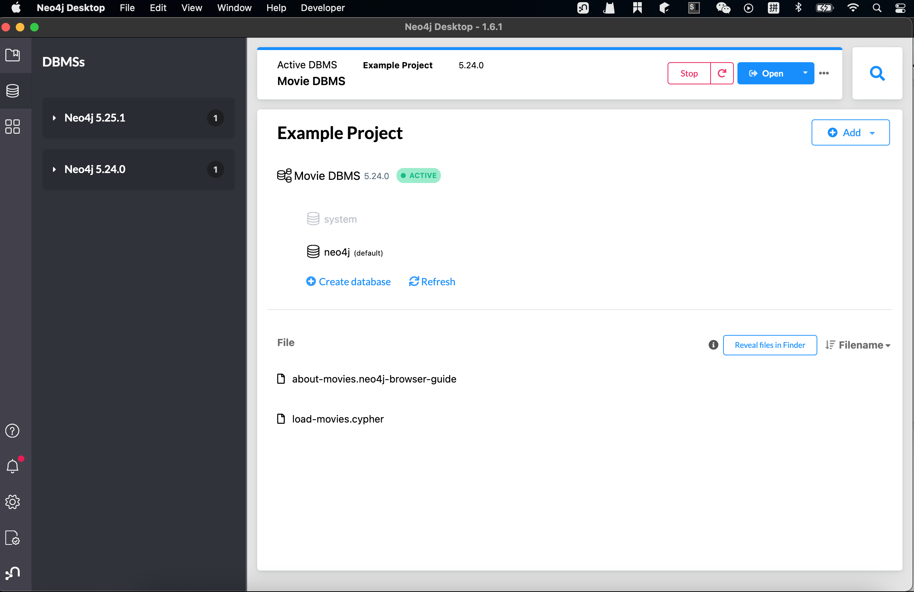
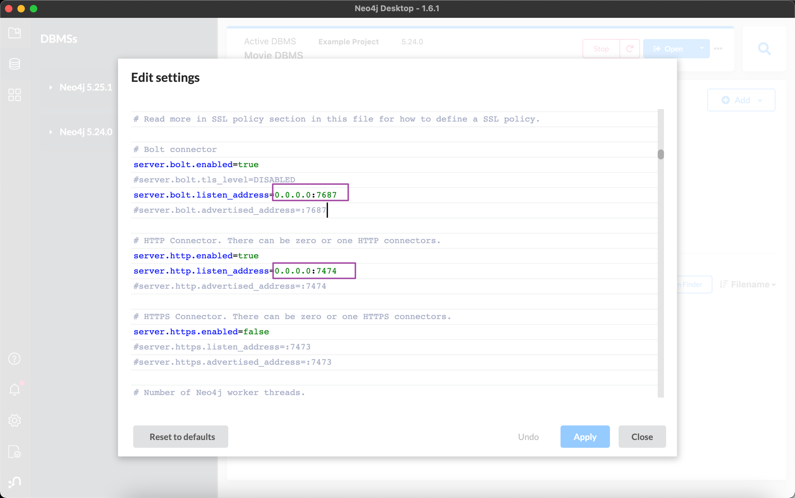

> [知识图谱与图数据库Neo4j--Part01]() <--- Part01

## 一. 图数据库和关系型DB的对比

从技术上来说, 用关系型数据库(如pgSQL, MariaDB)来存储知识图谱,是完全没问题的, 但一旦知识图谱变复杂,用传统的[**关系数据存储**], 查询效率会显著低于[**图数据库**], 在一些涉及到2,3度的关联查询场景, 图数据库能把查询效率提升几千倍甚至几百万倍. 
而且基于图的存储在设计上会非常灵活, 一般只需要有局部的改动即可, 当场景数据规模较大时, 建议使用图数据库来进行存储

## 二. Neo4j

和关系型数据库一样, 图数据库的可选产品也有很多, 根据知名数据库排名网站[db-engines](https://db-engines.com/en/ranking/graph+dbms)中的数据进行参考,Neo4j在图数据库产品中的地位无人出其右,因此之后将会围绕Neo4j完成:

### 安装Neo4j

较为建议的安装方式是在docker中进行安装, 参考[Neo4j官方文档:通过docker安装](https://neo4j.com/labs/apoc/4.4/installation/#docker)
但因为笔者的mac系统比较老,对Docker的支持是一坨, 所以安装的是[Neo4j Desktop](https://neo4j.com/labs/apoc/4.4/installation/#neo4j-desktop)

解除远程连接Neo4j的限制, 允许远程访问:

> 下一Part介绍: **SDN**(Spring Data Neo4j) ---> [知识图谱与图数据库Neo4j--Part03]()

